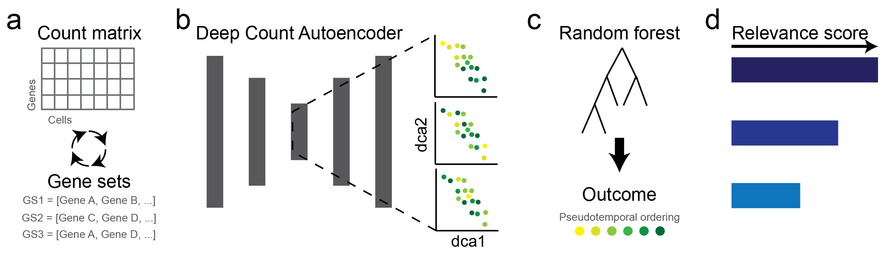

# DrivAER for manifold interpretation in scRNA-seq data
**DrivAER** is a method for identification of **Driv**ing transcriptional programs based on **A**uto**E**ncoder derived **R**elevance scores. 
DrivAER infers relevance scores for transcriptional programs with respect to specified outcomes of interest in single-cell RNA sequencing data, such as psuedotemporal ordering or disease status..

See our manuscript (Jupyter notebook to reproduce figures can be found in the Reproducibiliy folder) and [tutorial](https://github.com/lkmklsmn/TFscoring/blob/master/DrivAER_Tutorial.ipynb) for more details.

 

**Workflow** (a) DrivAER iteratively subjects annotated gene sets to unsupervised dimension reduction via DCA. (b) For each gene set the generated two-dimensional data manifold coordinates are used as (c) input features in a random forest model to predict the outcome of interest (i.e. pseudotemporal ordering). (d) The random forest prediction accuracy represents the relevance score. 

## Check out our live, interactive tutorial (hosted by Google colab)
[Blood development](https://colab.research.google.com/github/lkmklsmn/DrivAER/blob/master/Tutorial/DrivAER%20-%20blood%20development)
[Interferon stimulation](https://colab.research.google.com/github/lkmklsmn/DrivAER/blob/master/Tutorial/DrivAER%20-%20interferon%20stimulation)

## Installation
### Via pip
	pip install -i https://test.pypi.org/simple/ DrivAER==0.0.1

## Input
1. Raw count expression matrix
2. Outcome of interest (pseudotemporal ordering/cell grouping etc)
3. Gene set annotation

## Results
1. Relevance scores for each annotated transcriptional program
2. Data manifolds derived from each transcriptional program
3. Various visualizations (heatmap, DCA embedding, barplots)

## Usage

### Annotations
DrivAER provides a number of annotations by default. Users can add annotations using the following format:
#### Gene set annotations in gmt format
| Gene set | Source | Gene1 | Gene2 | Gene3|
| ---------- | ---------- |  :----:  |  :----:  |  :----:  | 
| set1 | source | gene1 | gene2 | gene3 |
| set2 | source | gene1 | gene2 | gene3 |
| set3 | source | gene1 | gene2 | gene3 |
	import DrivAER as dv
	C3_mouse = dv.get_anno(filename = "C3.gmt", filetype = "gmt", conv_mouse = True)
#### Transcription factor - target pairs in tsv format
| Transcription factor | Target | Type | Source|
| ---------- | ---------- |  :----:  |  :----:  | 
| set1 | gene1 | XX | XX |
| set1 | gene2 | XX | XX |
| set1 | gene3 | XX | XX |
| set2 | gene1 | XX | XX |
	trrust_human = dv.get_anno(filename = "trrust_human.tsv", filetype = "tsv", conv_mouse = False)
### Calculate relevance scores
	res = dv.calc_relevance(count = your_count, pheno = your_pt, datatype = "continuous", tf_targets = C3_mouse, min_targets=5,
                   ae_type="nb-conddisp", epochs=3, early_stop=3, hidden_size=(8, 2, 8), verbose=False)
### Generate visualizations
	dv.rank_plot(res, save)
	dv.embedding_plot(result, tf_name, pheno, datatype, save)
	dv.gene_plot(result, count, tf_name, gene, save)
